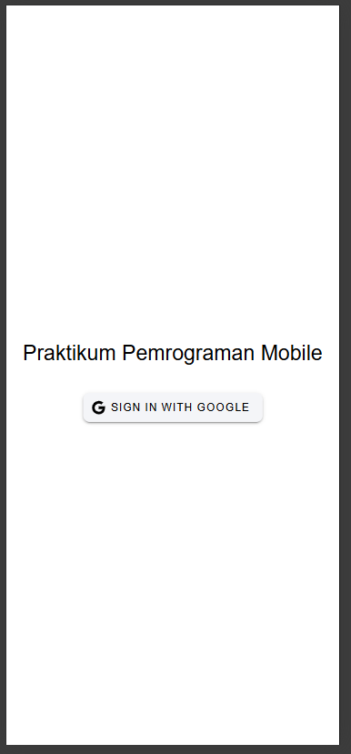
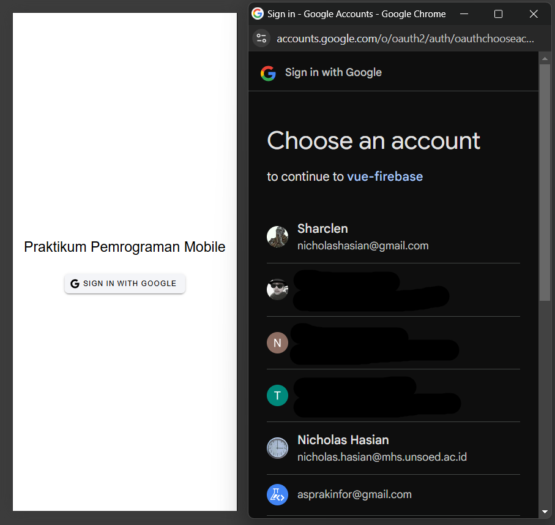
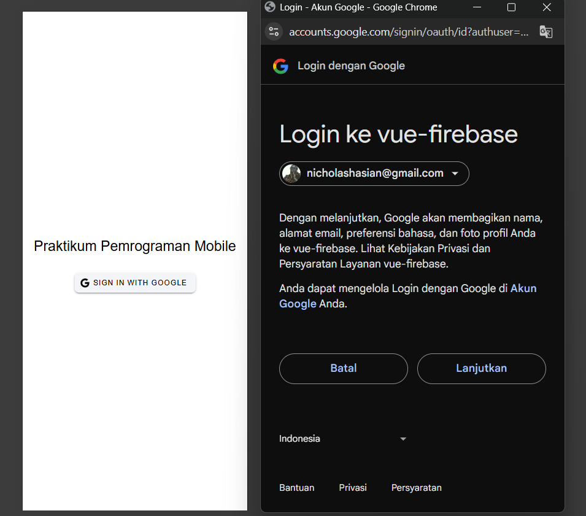
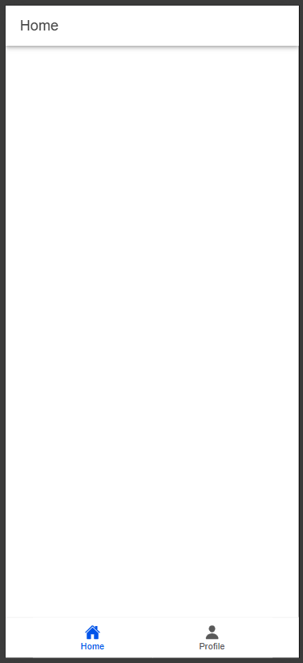
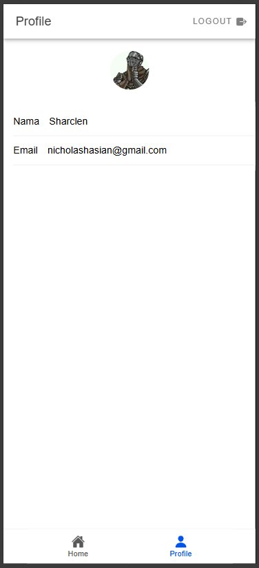

# Tugas 9 PrakPemMob

## Penjelasan dan Screenshot

### 1. Tampilan Awal (Login Page)

Login Page merupakan landing page atau halaman pertama yang muncul saat aplikasi dijalankan, Login Page akan menampilkan judul aplikasi dan tombol "Sign In with Google". Tombol ini menggunakan komponen ion-button dan icon Google yang akan mengtrigger proses login apabila diklik.
Apabila terjadi kesalahan saat melakukan proses login maka akan ditampilkan pesan yang memberitahukan bahwa proses login gagal dan user diminta untuk mencoba kembali.

  - Saat dibuka, aplikasi akan menginisialisasi Firebase dengan konfigurasi yang dibuat dalam firebase.ts
  - Kemudian Google Auth akan diinisialisasi mmenggunakan client ID yang terdaftar
  - Pinia store (auth.ts) disiapkan untuk manajemen state autentikasi

### 2. Pilih Akun

Ketika user menekan tombol Sign In With Goole, akan muncul Pop-up untuk memilih akun Google yang ingin digunakan untuk Login, hal ini merupakan interface bawaan dari Google OAuth. Proses ini menggunakan @codetrix-studio/capacitor-google-auth untuk menangani autentikasi pada platform mobile.

  - Saat user menekan tombol "Sign In with Google", method loginWithGoogle() di auth store akan dipanggil,
  - Capacitor Google Auth kemudian akan menampilkan popup untuk pemilihan akun
  - Setelah user memilih akun, Google akan mengembalikan token yang kemudian akan dipakai untuk membuat credential Firebase
  - User data disimpen di state Pinia

### 3. Konfirmasi

Setelah memilih akun, user akan diminta untuk mengkonfirmasi sekali lagi sebelum benar-benar masuk menggunakan akun yang dipilih

### 4. Home Page

Setelah login berhasil, user akan diarahkan ke Home Page, halaman home ini memiliki navigasi di bagian bawah untuk beralih ke halaman profile

  - Setelah autentikasi berhasil, Firebase akan memberikan objek User
  - Router guard (beforeEach) kemudian akan memeriksa status autentikasi
  - Halaman yang perlu autentikasi yaitu home dan profile akan dilindungi dan dibuat dua ketentuan
      A. User yang belum login akan diarahkan ke halaman login dan tidak dapat mengakses halaman home meskipun melalui url
      B. User yang sudah login tidak bisa mengakses halaman login lagi sampai melakukan proses logout

### 5. Profile Page

Halaman ini menampilkan informasi dari user yang sedang Login, foto profil diambil dari foto akun Google user menggunakan ion-avatar, nama diambil dari username akun google user dengan displayName, dan email diambil dari email Google user. Kemudian terdapat juga tombol Logout pada halaman profile ini.

  - Data untuk profil user berupa foto, nama, dan email diambil dari objek User yang sebelumnya diberikan oleh Firebase
  - Data disimpen di Pinia store dan bisa diakses di seluruh aplikasi, komponen Profile kemudian mengakses data ini melalui computed property
  - Saat user menekan tombol logout, method logout() akan dipanggil dan Firebase signOut() dan Google signOut() akan dijalankan
  - State user dalam Pinia kemudian akan dibersihkan dan user diarahkan kembali ke halaman login
